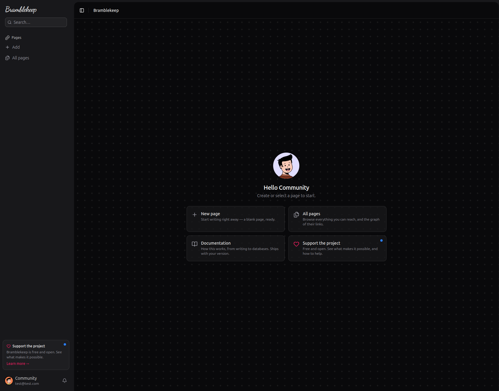
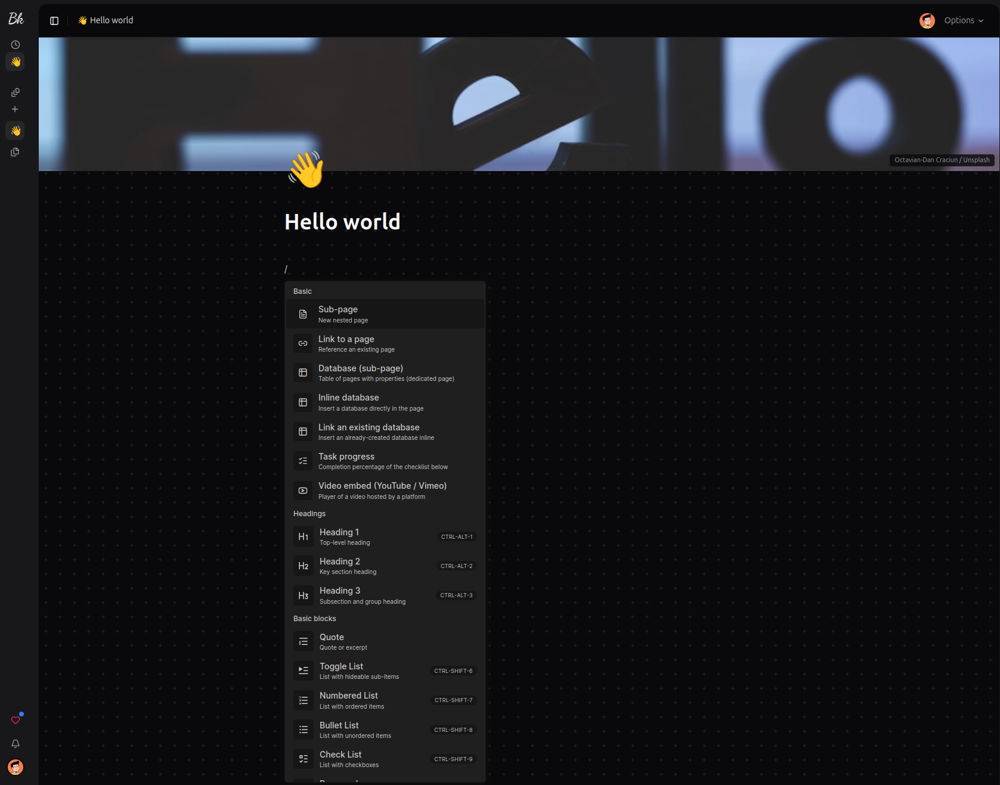
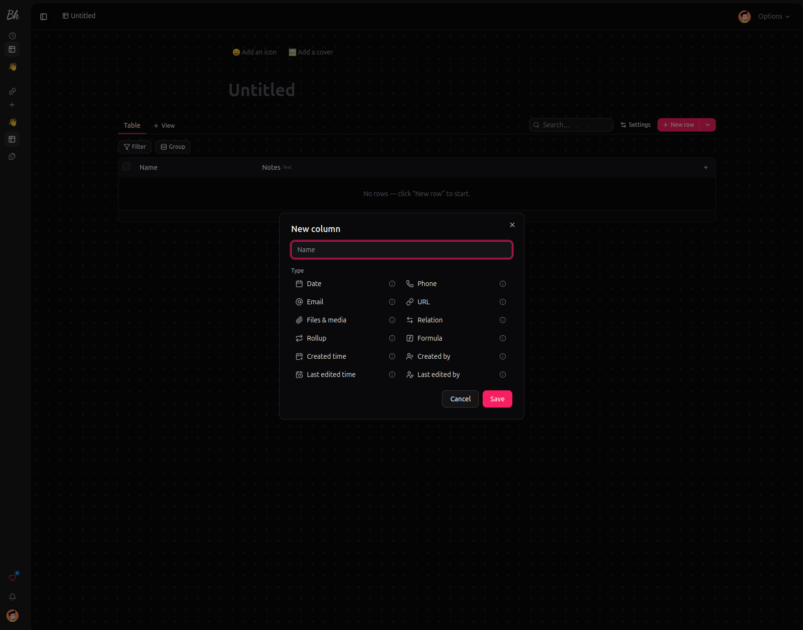

# Bramblekeep

[](https://github.com/merrypatch/bramblekeep/issues?q=is%3Aopen+is%3Aissue+label%3A%22good+first+issue%22)

Unified, self-hosted, **single-binary** workspace — a free, open-source alternative to the proprietary all-in-one tools (Notion, Coda, Confluence, ClickUp, and the like), without the vendor lock-in. Your data stays in a single file you own.

Rust backend (Axum + SQLite) + embedded Vite/React/TypeScript frontend. The release binary + `bramblekeep.db` + the `files/` folder = the complete installation.

<p align="center">
  
</p>
<p align="center"><sub>Home — where to go from a standing start, with your page tree in the sidebar.</sub></p>

<p align="center">
  
</p>
<p align="center"><sub>A page — cover with the photographer's credit, emoji icon, and the <code>/</code> menu: sub-pages, inline databases, embeds, headings, lists.</sub></p>

<p align="center">
  
</p>
<p align="center"><sub>A database — typed columns, including relation, rollup, formula and read-only metadata.</sub></p>

## What it does

- **Pages and blocks.** A rich editor (BlockNote) over a CRDT: several people type in the same page at once, and the content survives a restart of the server. Sub-pages nest to any depth, `@` mentions link pages together and are listed back as **backlinks**.
- **Databases.** Fourteen column types plus four read-only metadata ones, and six views over the same rows: **table, board (kanban), calendar, gallery, chart, graph** — each with its own filters, sort and search. Rows are real pages you can open and write inside.
- **Relations, rollups, formulas.** Link two databases, aggregate across the link, or compute a value from the row (28 functions across logic, numbers, text and dates).
- **Charts.** Bars, line, area, pie, radar, radial — grouped by hour / day / week / month on a date axis, split into series by any column (a relation included), with cumulative, remaining and burndown transforms.
- **A graph view**, in a database and across all your pages: relation links and page references, laid out by a force simulation computed in the browser.
- **Sharing.** Per-page levels (read / edit / creator / admin) inherited by the subtree, workspace roles (owner / admin / member), and **public pages** — a token link readable without any account, optionally covering the subtree.
- **Sign-in your way.** Email + password (no mail relay needed) or a magic link when SMTP is configured. Opaque sessions, no JWT — and an optional `SETUP_CODE` if the instance is exposed before you claim it.
- **Built-in documentation**, ten chapters shipped inside the binary, so it always matches the version you run. English, French and Spanish, like the rest of the interface.
- **Backups you can actually restore.** One archive, from Settings, with the instance running: the database *and* every uploaded file. The database inside it is taken through SQLite itself, not copied off a live file, so it is consistent even mid-edit. A snapshot is also written automatically before a one-click update, so a bad migration is one file away from being undone.
- **The small things that matter**: full-text search inside content, favourites, drag & drop of the page tree, 30-day trash, per-page change history, content-addressed uploads, Markdown / PDF / CSV export, CSV and relation-preserving ZIP import, light/dark themes, and installable as a PWA.

Zero telemetry, and no outbound network call unless you ask for one — update checking is opt-in.

## Getting started (self-host)

### Fastest: one command (Linux)

This installs Bramblekeep as a Docker container (with an optional Watchtower
sidecar for one-click in-app updates). If Docker isn't present, it offers to
install it. Works on any Linux box — a Raspberry Pi (64-bit), a home server, a VPS:

```bash
curl -fsSL https://raw.githubusercontent.com/merrypatch/bramblekeep/master/install.sh | sudo bash
```

It prints the URL to open. The first visitor creates the owner account with an
email and a password — no SMTP needed. The script is inspectable: read
[`install.sh`](./install.sh) before piping it to a shell.

If the port is reachable before you get to that first screen, add
`SETUP_CODE=a-long-secret` to the command: creating the owner then requires it.
Otherwise, whoever opens the instance first claims it.

Useful overrides:

- `PUBLIC_BASE_URL=https://notes.example.com` — the URL users actually reach (default: the host's IP).
- `SETUP_CODE=a-long-secret` — require that secret to create the owner account.
- `PORT=9000` — host port to publish (default `8080`).
- `NO_DOCKER=1` — install the bare binary + a systemd service instead of Docker.
- `VERSION=v0.11.0` — pin a version. `--uninstall` — remove it (your data is kept).

### Docker (manual)

The published image is multi-arch (`amd64` + `arm64`, incl. Raspberry Pi 64-bit).
Your data lives in a `/data` volume, so it survives restarts and upgrades:

```bash
docker run -d --name bramblekeep \
  -p 8080:8080 \
  -v bramblekeep-data:/data \
  ghcr.io/merrypatch/bramblekeep:latest
```

Then open `http://localhost:8080` and create the owner account (email +
password — nothing to configure). Inviting other people needs SMTP: they sign in
through an emailed link. Without SMTP you can still invite and hand over the link
yourself, and sign-in links are printed to the logs (`docker logs -f bramblekeep`).

Prefer Compose? A ready [`docker-compose.yml`](./docker-compose.yml) is in the
repo (volume, ports, Watchtower one-click updates, commented SMTP / HTTPS):

```bash
docker compose up -d
```

**Upgrading** is `docker compose pull && docker compose up -d`; your `/data`
volume is untouched. The compose file also ships an optional **Watchtower**
sidecar so the in-app **Update** button works in Docker: it backs up the
database, then Watchtower pulls the new image and recreates the container —
bramblekeep never touches the Docker socket itself. Delete the `watchtower`
service to upgrade manually.

### On a PaaS or app store (Dokploy, Coolify, runtipi, CasaOS…)

Point the platform at the image `ghcr.io/merrypatch/bramblekeep:latest` (or paste
the [`docker-compose.yml`](./docker-compose.yml)). The platform's proxy handles
TLS, so **delete the `ports:` block** (it reaches the container over the internal
network), set `PUBLIC_BASE_URL=https://your-domain` and `COOKIE_SECURE=true`.

### Without Docker (bare binary + systemd)

For hosts where you'd rather not run Docker, install the signed static Linux
binary as a systemd service (x64 or arm64):

```bash
curl -fsSL https://raw.githubusercontent.com/merrypatch/bramblekeep/master/install.sh | sudo NO_DOCKER=1 bash
```

Or grab the `.tar.gz` from the [latest release](https://github.com/merrypatch/bramblekeep/releases/latest) and run its bundled installer:

```bash
tar xzf bramblekeep-linux-x64.tar.gz && cd bramblekeep-linux-x64
sudo ./deploy/install.sh
```

Either way it runs as a dedicated `bramblekeep` user under systemd:

| Event | Result |
| --- | --- |
| Crash / non-zero exit | restarts automatically |
| Reboot or power-off → power-on | starts automatically |
| `sudo systemctl stop bramblekeep` | stays stopped until the next boot |
| `sudo systemctl disable --now bramblekeep` | stays stopped across reboots too |

Logs: `journalctl -u bramblekeep -f`. Re-run the installer to update in place.
The binary is statically linked (musl) — it also runs directly on any Linux with
no dependencies: `./bramblekeep-linux-x64`.

### Configuration

Docker deployments are configured via environment variables (the installer writes
them to `/opt/bramblekeep/.env`); bare-binary installs read a `.env` next to the
binary (copy [`.env.example`](./.env.example)):

- `PUBLIC_BASE_URL` — the URL users actually reach; sign-in and shared-page links are built from it.
- `SMTP_*` — send sign-in / invitation emails. Without it, password sign-in still
  works and invitation links must be passed on by hand.
- `COOKIE_SECURE=true` — set when serving over HTTPS (reverse proxy / tunnel).
- `SETUP_CODE` — optional secret required to create the **owner** account. Set it
  when the instance is reachable before you have signed up; leave it out and the
  first visitor claims the instance. It gates nothing else and becomes inert once
  the account exists.
- `PORT` (Docker) / `BIND_ADDR` (binary) — change the listen port.

Locked out (forgotten password on an instance that cannot send email)?
`bramblekeep set-password <email>` resets it from the server — the password is
read on stdin, and on an instance with no account it creates the owner.

### Backup and restore

Three things, and nothing else: the SQLite database (`bramblekeep.db`), the
`files/` folder (uploads, addressed by content hash), and your `.env`. No external
service to restore, no queue to drain.

The owner downloads a single `.zip` from **Settings → Workspace → Backup**, with
the instance running — `backup.json` (what it is), `bramblekeep.db` and
`files/<hash>` for every upload. The database goes through SQLite itself
(`VACUUM INTO`), so it is consistent even mid-edit. A plain database snapshot is
also written beside the live one before a one-click update applies its
migrations, named `bramblekeep.db.bak-<version>`.

> **Do not `cp` a running database.** It runs in WAL mode: recent commits live in
> `bramblekeep.db-wal`, and a plain copy catches the file mid-write — a backup
> missing its last transactions, or one that will not open. Use the button, or
> stop the server first.

To restore, stop the instance and hand the archive to the binary:

```bash
docker compose down                 # or: sudo systemctl stop bramblekeep
bramblekeep restore bramblekeep-backup-0.12.0-1234567890.zip
```

Under Docker the binary is the image's entrypoint, so run it against the same
volume — the restored files then belong to the service account, not to root:

```bash
docker run --rm -v bramblekeep-data:/data -v "$PWD":/backup \
  ghcr.io/merrypatch/bramblekeep:latest \
  restore /backup/bramblekeep-backup-0.12.0-1234567890.zip --yes
```

It checks the archive first, refuses one this binary is too old to read, refuses
to run while the instance is still up, keeps the database it replaces, and prints
the command that undoes it. Migrations run at startup, so an older backup opens on
a newer binary; the reverse is refused rather than half-applied.

Doing it by hand is documented in the built-in *Installing and updating* chapter,
including the one step — deleting `bramblekeep.db-wal` and `-shm` — that
otherwise leaves SQLite replaying the old writes onto the restored file, with the
server coming up fine and serving a silent mixture of both.

Worth doing once, before you ever need it:

```bash
unzip -t your-backup.zip                           # must report no errors
unzip -p your-backup.zip backup.json               # which version and schema
unzip -p your-backup.zip bramblekeep.db > /tmp/check.db
sqlite3 /tmp/check.db "PRAGMA integrity_check;"    # must print: ok
sqlite3 /tmp/check.db "SELECT COUNT(*) FROM items;"
```

The full procedure, including rolling back a bad update, is in the built-in
documentation under *Installing and updating*.

## Status

Active development, and usable today for what the list above describes: pages
synced over WebSocket (yrs CRDT), persisted in `yjs_updates` and projected to
`blocks` — a restart of the binary loses nothing — plus databases and their six
views, sharing, public pages, and the built-in documentation. Releases ship signed
static binaries and a multi-arch Docker image, with one-click in-app updates
(self-replace on bare metal, Watchtower on Docker).

Reserved in the schema and deliberately not built yet: S3 file storage, and
ingesting content from other channels (inbound email, messaging). Sending mail
exists — receiving does not.

## Prerequisites

- Stable Rust + Cargo
- Node 20+ and pnpm

## Development (Contributors)

After a `git pull`, a single command installs frontend dependencies and starts the backend (:8080) + Vite (:5173) together, with hot-reload active:

```bash
./scripts/dev.sh
```

Open http://localhost:5173 — the frontend proxies `/api` to the backend. `Ctrl-C` stops both.

<details><summary>Manual equivalent (2 terminals)</summary>

```bash
cargo run                          # backend :8080
cd web && pnpm install && pnpm dev # frontend :5173, proxy /api → :8080
```
</details>

## Release Build (Single Binary)

Produces the distributable executable — embedded frontend, no Node required at runtime:

```bash
./scripts/build.sh
```

Result: `./target/release/bramblekeep`. Distributing this file alone is sufficient; it serves the API and the frontend on :8080 and creates `bramblekeep.db` + `./files` at first launch.

<details><summary>Manual equivalent</summary>

```bash
cd web && pnpm build          # generates web/dist, embedded by rust-embed
cd .. && cargo build --release
```
</details>

## Validation Before Committing

```bash
cargo clippy --all-targets -- -D warnings && cargo test \
  && (cd web && pnpm typecheck && pnpm lint && pnpm test)
```

CI runs the same gate, plus a blocking supply-chain audit (`cargo audit`,
`cargo deny`, and an OSV scan of the frontend lockfile).

## Architecture

Mono-crate `bramblekeep` with internal modules: `core` (pure domain types and
tree/credential logic, zero I/O), `store` (SQLite, additive migrations, FTS5),
`sync` (yrs CRDT and the update log), `auth`, `routes`, `files`, `mail`, `search`,
`update`, `embed` and `config`. The dependency direction remains strictly
one-way: `core` depends on nothing internal. Extraction into dedicated crates
will happen only when a boundary becomes problematic in practice — see addendum
D4.

All content **writes** go through the CRDT; all **reads** (search, views, export)
go through the `blocks` projection rebuilt from it. Writing to `blocks` directly
would be the one architectural bug that matters here.

## Contributing

Pull requests welcome — see [`.github/CONTRIBUTING.md`](./.github/CONTRIBUTING.md)
and the [Code of Conduct](./CODE_OF_CONDUCT.md). Contributions are accepted under a
lightweight [Contributor License Agreement](./CLA.md) (you keep ownership of your
work); a bot walks you through signing on your first PR.

Found a security problem? Report it privately through the
[security policy](./SECURITY.md) — not in a public issue.

## License

Bramblekeep is **dual-licensed**:

- **[GNU AGPL-3.0-or-later](./LICENSE)** — free and open source. Self-host, modify, and share under the AGPL.
- **Commercial license** — for use cases where the AGPL's copyleft (including its network/SaaS clause) is not acceptable.

Which one you need, and how to obtain a commercial license, is explained in **[`LICENSING.md`](./LICENSING.md)**.
